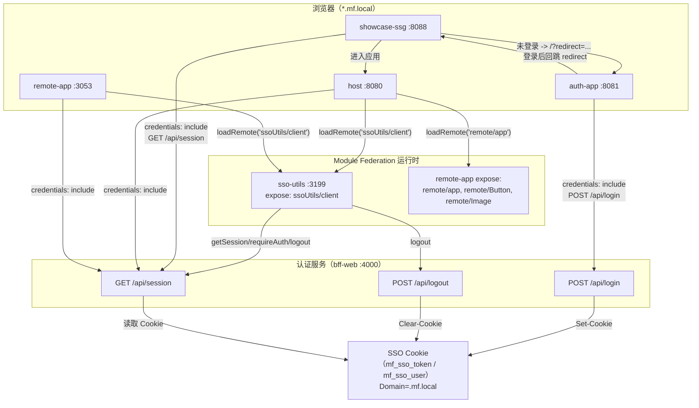
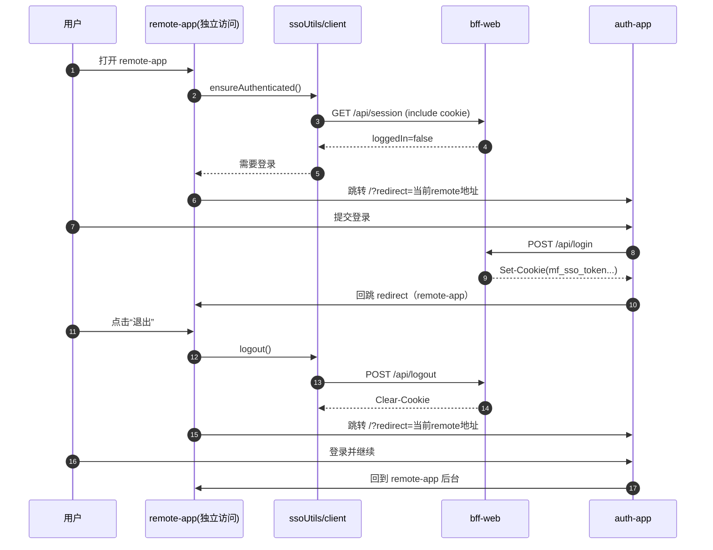
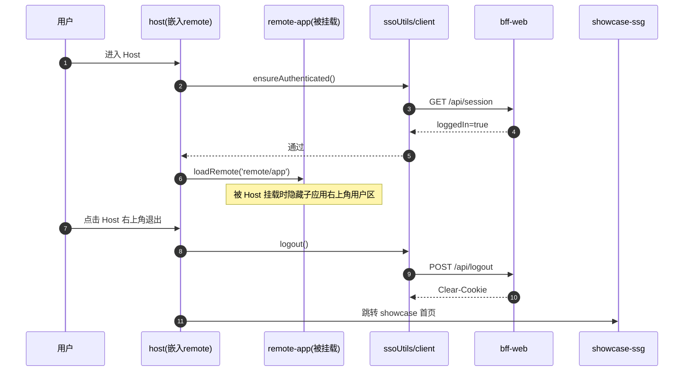

# Module Federation Modern (Nx Monorepo)

基于 `Modern.js + Module Federation + BFF` 的微前端演示仓库，当前聚焦以下能力：

- Host 挂载 Remote（组件级 + 应用级）
- SSO 统一登录（Auth + BFF + 跨应用 Cookie）
- Showcase 作为入口页，登录后进入 Host
- Nx 管理多应用构建与运行

## 项目目录（当前）

```text
module-federation-modern/
├─ package.json
├─ nx.json
├─ pnpm-workspace.yaml
└─ packages/
   ├─ host/                  # 主应用容器
   ├─ remote-app/            # 远程子应用
   ├─ sso-utils/             # SSO MF 工具（exposes: ./client）
   ├─ auth-app/              # 统一认证页
   ├─ showcase-ssg/          # 展示入口页（SSG）
   └─ bff-web/               # 认证 API（/api/*）
```

## 应用与端口

| 应用 | 目录 | 端口 | 说明 |
| --- | --- | --- | --- |
| Host | `packages/host` | `8080` | 主容器，加载 `remote-app` 和 `sso-utils` |
| Remote App | `packages/remote-app` | `3053` | 子应用，可独立运行或被 Host 挂载 |
| SSO Utils | `packages/sso-utils` | `3199` | MF 远程工具，暴露 `ssoUtils/client` |
| Auth App | `packages/auth-app` | `8081` | 登录页与回跳控制 |
| Showcase SSG | `packages/showcase-ssg` | `8088` | 对外入口，登录后显示“进入应用” |
| BFF Web | `packages/bff-web` | `4000` | 会话、登录、登出 API |

## 本地域名（推荐）

建议配置 hosts 以验证跨子域 Cookie：

```text
127.0.0.1 host.mf.local remote.mf.local auth.mf.local showcase.mf.local api.mf.local
```

访问地址：

- Host: `http://host.mf.local:8080`
- Remote: `http://remote.mf.local:3053`
- SSO Utils: `http://localhost:3199`（通常仅作为 MF remote 使用）
- Auth: `http://auth.mf.local:8081`
- Showcase: `http://showcase.mf.local:8088`
- BFF API: `http://api.mf.local:4000`

## 快速开始

1. 安装依赖

```bash
pnpm install
```

2. 启动核心服务

```bash
pnpm run app-verbose
```

等价命令：

```bash
pnpm nx run-many --target=serve --configuration=development -p host,remote-app,auth-app,showcase-ssg,bff-web,sso-utils --parallel=6 --output-style=stream --verbose
```

3. 访问 Showcase

```text
http://showcase.mf.local:8088
```

4. 构建全部应用

```bash
pnpm run build
```

## 当前 Nx 项目

```text
host
remote-app
sso-utils
auth-app
showcase-ssg
bff-web
```

## Module Federation 拓扑

- `host` remotes
  - `remote@http://localhost:3053/mf-manifest.json`
  - `ssoUtils@http://localhost:3199/mf-manifest.json`
- `remote-app` remotes
  - `ssoUtils@http://localhost:3199/mf-manifest.json`
- `remote-app` exposes
  - `./Image`
  - `./Button`
  - `./app`
- `sso-utils` exposes
  - `./client`

## SSO 行为说明（当前实现）

1. 业务应用调用 `GET /api/session` 判断登录态。
2. 未登录时跳转到 `auth-app/?redirect=<来源地址>`。
3. `auth-app` 调用 `POST /api/login`，BFF 下发登录 Cookie。
4. 登录后回跳来源地址。
5. Host / Remote 通过 `loadRemote('ssoUtils/client')` 获取统一认证契约。
6. Host 右上角显示用户头像，下拉可退出，默认退出回到 Showcase。
7. Remote 独立运行时显示用户信息和退出，退出会跳转到 auth-app 并携带当前页 `redirect`，登录后返回 Remote；被 Host 挂载时隐藏右上角用户区。
8. Showcase 未登录只显示“登录统一认证”；登录后显示“进入应用”按钮。

## BFF API（`packages/bff-web/api/lambda`）

- `POST /api/login`
- `GET /api/session`
- `POST /api/logout`
- `GET /api/dashboard`

## 常用命令

```bash
pnpm nx show projects
pnpm nx run host:serve
pnpm nx run remote-app:serve
pnpm nx run sso-utils:serve
pnpm nx run auth-app:serve
pnpm nx run showcase-ssg:serve
pnpm nx run bff-web:serve
```

## 可选环境变量

认证与回跳相关：

- `AUTH_DEFAULT_REDIRECT_URL`（auth-app 默认回跳地址）

`remote-app` 退出回跳地址优先通过 MF 挂载参数传入，例如：

```tsx
<RemoteAppCreate basename="/remote-app" logoutRedirectUrl="http://auth.mf.local:8081/" />
```

BFF Cookie / CORS 相关：

- `MF_SSO_ALLOWED_ORIGINS`
- `MF_SSO_COOKIE_SAMESITE`
- `MF_SSO_COOKIE_SECURE`
- `MF_SSO_COOKIE_DOMAIN`
- `MF_SSO_SESSION_MAX_AGE`
- `MF_SSO_CSRF_MAX_AGE`

## 参考文档

- Modern.js: <https://modernjs.dev/zh/>
- Module Federation: <https://module-federation.io/zh/>
- Nx: <https://nx.dev/>

## VS code 

> 装扩展：Markdown Preview Mermaid Support





